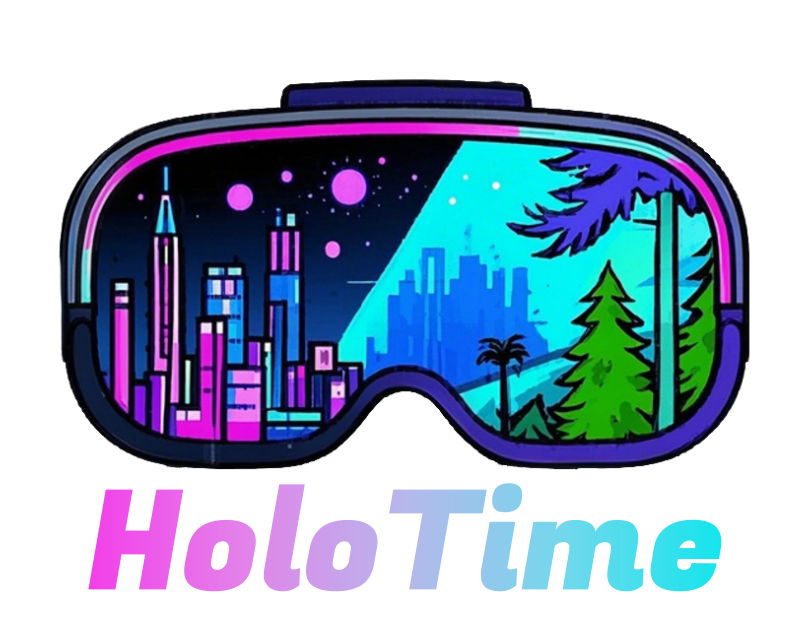
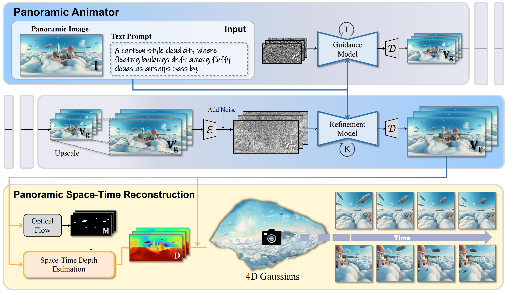
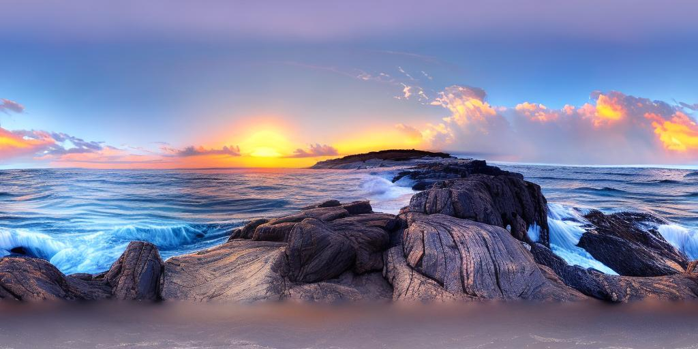
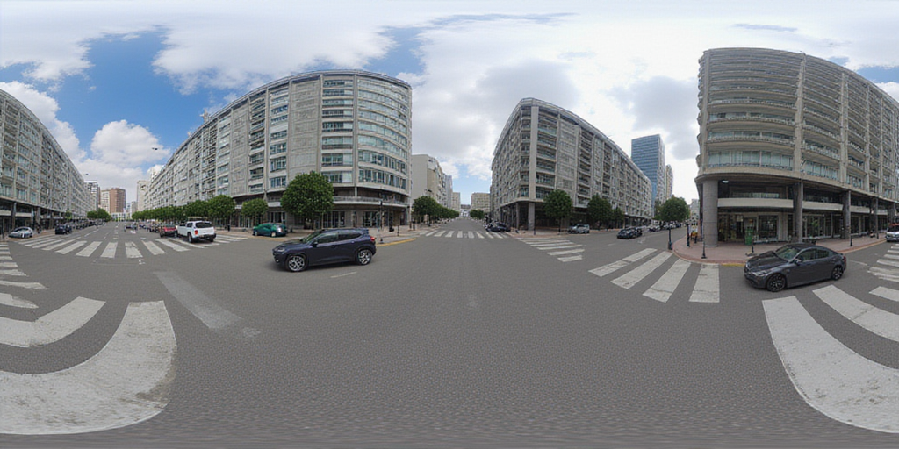
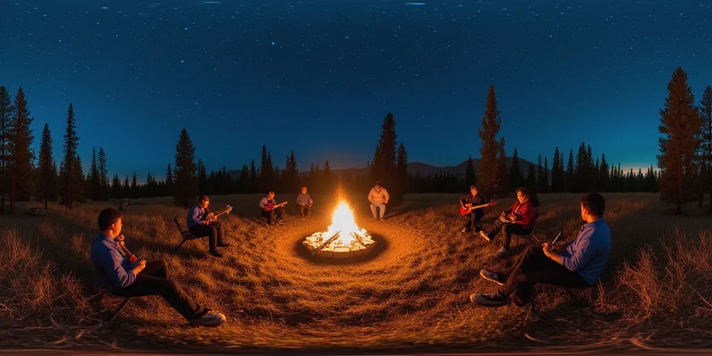

<div align="center">
</img>
<h2 align="center"> <a href="https://github.com/PKU-YuanGroup/HoloTime/">HoloTime: Taming Video Diffusion Models for Panoramic 4D Scene Generation</a></h2>
 <a href='https://github.com/PKU-YuanGroup/HoloTime/'></a> &nbsp;
 <a href='https://zhouhyocean.github.io/holotime/'></a> &nbsp;
 <a href='https://www.youtube.com/watch?v=reJ7H-Pe2MQ'></a>&nbsp;
 <a href='https://huggingface.co/Marblueocean/HoloTime'></a> &nbsp;

_**[Haiyang Zhou*](), [Wangbo Yu*](https://scholar.google.com/citations?user=UOE8-qsAAAAJ&hl=zh-CN), [Jiawen Guan](), [Xinhua Cheng](https://cxh0519.github.io/), [Yonghong Tian&dagger;](https://www.pkuml.org/staff/yhtian.html), [Li Yuan&dagger;](https://yuanli2333.github.io/)**_
<h5 align="center"> If you like our project, please give us a star ⭐ on GitHub for latest update. </h5>


<br>

</div>

# 📰 News

* **[2025.4.30]**  🔥🔥🔥 We have released our **Panoramic Animator** model and the inference code of the whole pipeline **HoloTime**.  Welcome to download it from [Huggingface](https://huggingface.co/Marblueocean/HoloTime) and have a try!


# 💡 Introduction

We propose **HoloTime**, a framework that integrates video diffusion models to generate panoramic videos from a single prompt or reference image, along with a 360-degree 4D scene reconstruction method that seamlessly transforms the generated panoramic video into 4D assets, enabling a fully immersive 4D experience for users.

<div align="center">
  
</div>

# 🚀 Results

## 4D Scene Generation

<table>
  <thead>
    <tr>
      <th>Panorama</th>
      <th>4D Scene</th>
    </tr>
  </thead>
  <tbody>
    <tr>
      <td>
        
      </td>
      <td>
        <video src="https://github.com/user-attachments/assets/7a3b6ecd-23b2-4c7f-a5d6-14aad4d9bf0a" autoplay controls></video>
      </td>
    </tr>
    <tr>
      <td>
        
      </td>
      <td>
        <video src="https://github.com/user-attachments/assets/59e916b8-e457-4b88-b80e-aa8c45db0d24" autoplay controls></video>
      </td>
    </tr>
    <tr>
      <td>
        
      </td>
      <td>
        <video src="https://github.com/user-attachments/assets/fa023f08-04ff-4772-96a4-1976998dae79" autoplay controls></video>
      </td>
    </tr>
  </tbody>
</table>

## Panoramic Video Generation

<table>
  <thead>
    <tr>
      <th>Panorama</th>
      <th>Panoramic Video</th>
    </tr>
  </thead>
  <tbody>
    <tr>
      <td>
        
      </td>
      <td>
        <video src="https://github.com/user-attachments/assets/a507a6a3-a3db-4bed-89be-6ce1af0f446d" autoplay controls></video>
      </td>
    </tr>
    <tr>
      <td>
        
      </td>
      <td>
        <video src="https://github.com/user-attachments/assets/44e2b221-0848-4308-9679-cbf2379cf22b" autoplay controls></video>
      </td>
    </tr>
    <tr>
      <td>
        
      </td>
      <td>
        <video src="https://github.com/user-attachments/assets/2088c136-984f-4591-92f7-f4f978740e90" autoplay controls></video>
      </td>
    </tr>
    <tr>
      <td>
        
      </td>
      <td>
        <video src="https://github.com/user-attachments/assets/95cf74da-aa74-4c47-8314-a0990cb8cd43" autoplay controls></video>
      </td>
    </tr>
  </tbody>
</table>

# 🛠️ Requirements and Installation

```bash
git clone https://github.com/PKU-YuanGroup/HoloTime
cd HoloTime
conda create -n holotime python=3.10 -y
conda activate holotime
conda install -c nvidia cuda-toolkit=12.4 -y
pip install torch==2.4.1 torchvision==0.19.1 torchaudio==2.4.1 --index-url https://download.pytorch.org/whl/cu124
pip install -r requirements.txt
```
After installation, please follow the instructions provided [here](./installation/README.md) to modify a few lines of some libraries.

# 🤖 Inference

## Panoramic Video Generation

1. The input directory structure should be like:
```bash
📦 input/
└── 🖼️ --panorama1.png
└── 🖼️ --panorama2.png
└── 🖼️ --panorama3.png
└──    ...
└── 📄 --text_prompts.txt
```
The txt file contains text descriptions of panoramas, with each line corresponding to one panorama, sorted according to the natural sort order of the png filenames.
You can use the text-driven panorama generation models ([PanFusion](https://github.com/chengzhag/PanFusion) or [FLUX](https://huggingface.co/jbilcke-hf/flux-dev-panorama-lora-2)) to create input data, or you can use the files we provide.

2. Download the **Panoramic Animator** model from [Huggingface](https://huggingface.co/Marblueocean/HoloTime) and then put the checkpoint in the checkpoints/holotime directory. (optional as it can be done automatically)

3. Run the following command.
```bash
sh run_animator.sh
```
**Panoramic Animator** need 24GB GPU memory.
VEnhancer need 80GB GPU memory for super resolution and frame interpolation. (optional) 

## 4D Scene Reconstruction
After generating the panoramic video, you can transform the panoramic video into 4D scene by running the following command.
```bash
sh run reconstruction.sh
```
Training Spacetime Gaussians need 48GB GPU memory.

## 4D Scene Rendering
Run the following command.
```bash
sh run reconstruction.sh
```
We provide some preset trajectories [here](utils/trajectory.py).


# 👍 Acknowledgement

Special thanks to [DynamiCrafter](https://github.com/Doubiiu/DynamiCrafter), [360DVD](https://github.com/Akaneqwq/360DVD), [VEnhancer](https://github.com/Vchitect/VEnhancer), [DreamScene360](https://github.com/ShijieZhou-UCLA/DreamScene360) and [Spacetime Gaussian](https://github.com/oppo-us-research/SpacetimeGaussians) for codebase and pre-trained weights.

# ✏️ Citation

```
To be updated.
```
